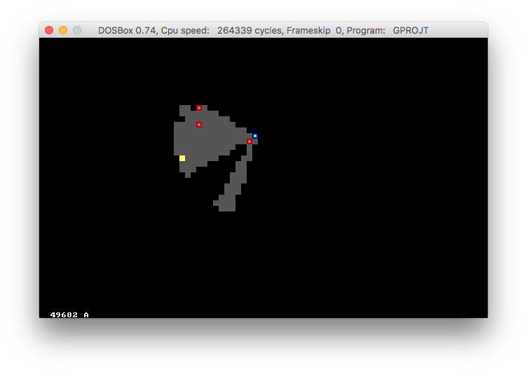
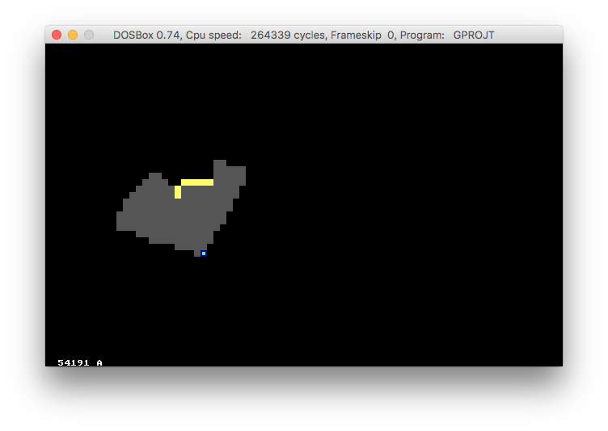

# pascal-torch-game
A top-down game where you move a character with a torch, written in TurboPascal 7.

Reqires TurboPascal 7.0 and MSDOS.
Probably works with [QuarkBox](https://github.com/notronik/quarkbox).

## What?
I made this while I was bored in a Computing lesson during my first year of 6th form. Currently you can walk around and illuminate different parts of the level based on your orientation. The approach used is a naive one: A set of rays are drawn out in the torch cone and are then followed. As soon as an inpenetrable object is encountered, the beam stops. Lightness is carved out of darkness. This yields some pretty cool light effects, and even shadows if you'd like to call them that.

If you use DOSBox, it's best to increase the cycles to 52,000 or more.

## Screenshots

# Controls
- <kbd>Q</kbd> to quit.
- <kbd>&uarr;</kbd> and <kbd>&darr;</kbd> to move forwards and backwards.
- <kbd>&larr;</kbd> or <kbd>A</kbd> and <kbd>&rarr;</kbd> or <kbd>D</kbd> to rotate.

## License
See [LICENSE](LICENSE). I modified the including in files bit because the TurboPascal compiler chokes on long files and I know the current one compiles.
